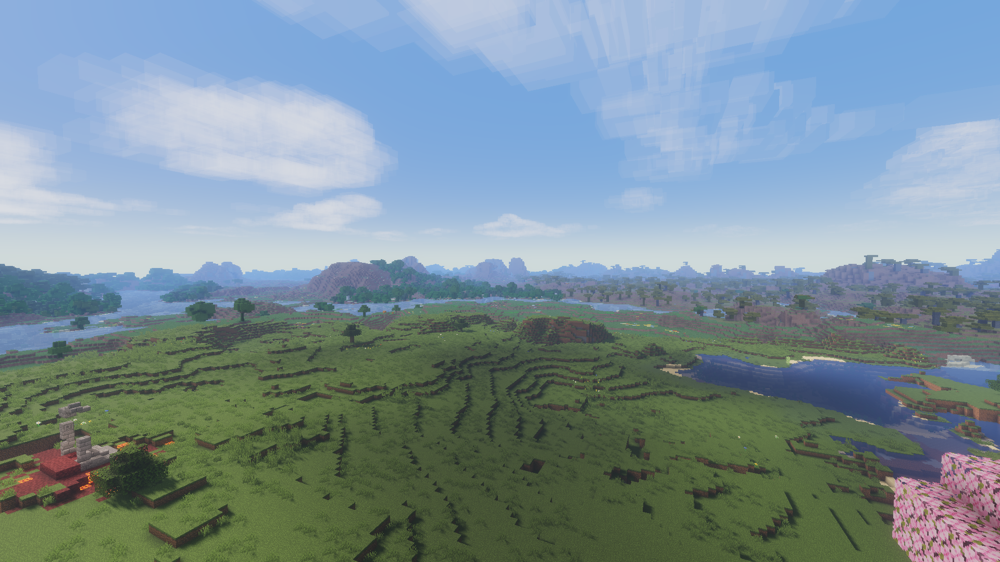

# Better Clouds for VulkanMod + Beryl (v26.1.x)

> I am not an official maintainer, nor am I a graphics engineer. I am however a web engineer with access to Gemini Pro. I think this effort came out quite well. I've only tested it with Minecraft v26.1.2 and VulkanMod v0.6.8 + Beryl v0.2.1.  
> -Christopher

---

This fork of Better Clouds introduces an edge softness vertex shader which produces a realistic look that is still imperfect, so as to suite the Minecraft style with Beryl shaders. You can set edge softness to 0% to restore a more traditional, blocky look many have come to expect from Better Clouds.

## Features

- **VulkanMod Native:** Fully re-engineered shader pipeline built specifically for VulkanMod, utilizing optimized uniform buffers (`std140` UBOs) for massive performance gains over vanilla rendering.
- **Dynamic Density Opacity:** Custom GPU-side shader math smoothly blends the transparency of wispy cloud edges while keeping dense internal clusters prominent and opaque.
- **Landscape Shadows:** Clouds become even more immersive by casting rolling shadows onto everything below them. A new noise algorithm was implemented to sync the clouds with their shadow counterparts (togglable if you prefer the Perlin clouds). Affects solid and translucent blocks as well as entities, plus it naturally fades away as you explore caves or enter buildings.
- **Atmospheric Weather States:** Takes full advantage of the new density rendering to make rainy and thundering weather states look visually distinct and impactful at any time of day.
- **Precision Noise Generation:** Overhauled the underlying noise samplers with double-precision math to eliminate visual artifacts and Moiré ("Farlands") patterns at extreme render distances.
- **Highly Customizable:** From edge softness and density multipliers to travel speeds and wind effects—practically every visual and performance metric is exposed directly through the Mod Menu.
- **Dynamic Mod Compatibility:** Works beautifully with dynamic weather systems like Serene Seasons and Fabric Seasons to automatically adjust cloud coverage and density.
- **Vanilla Aligned:** Adds gorgeous volumetric, multi-layered clouds that still feel right at home with Minecraft's blocky aesthetic!

## Requirements

To run this specific fork of Better Clouds, you must use the following mod setup:
- **Minecraft:** v26.1.2
- **Mod Loader:** Fabric
- **VulkanMod:** v0.6.8
- **Beryl:** v0.2.1

## Distant Horizons Compatibility

This mod natively supports rendering underneath Distant Horizons' LODs! To use Distant Horizons alongside VulkanMod and Beryl in Minecraft v26.1.2, make sure to use [our specially patched fork of Distant Horizons](https://github.com/cwright814/distant-horizons-vulkanmod).

> [!NOTE] Landscape shadow integration with Distant Horizons is planned sometime early September 2026.

## License

This software is licensed under [MPL 2.0](https://www.mozilla.org/en-US/MPL/2.0/FAQ/).  
The assets, except for the logo, are under [CC BY-SA](https://creativecommons.org/licenses/by-sa/4.0/).
